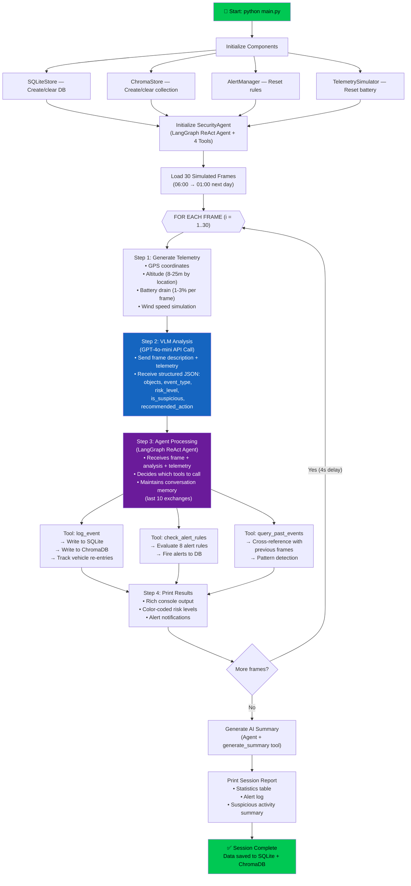
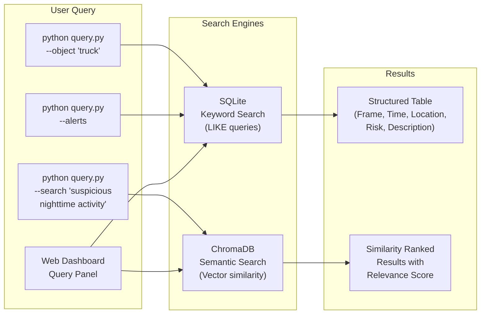
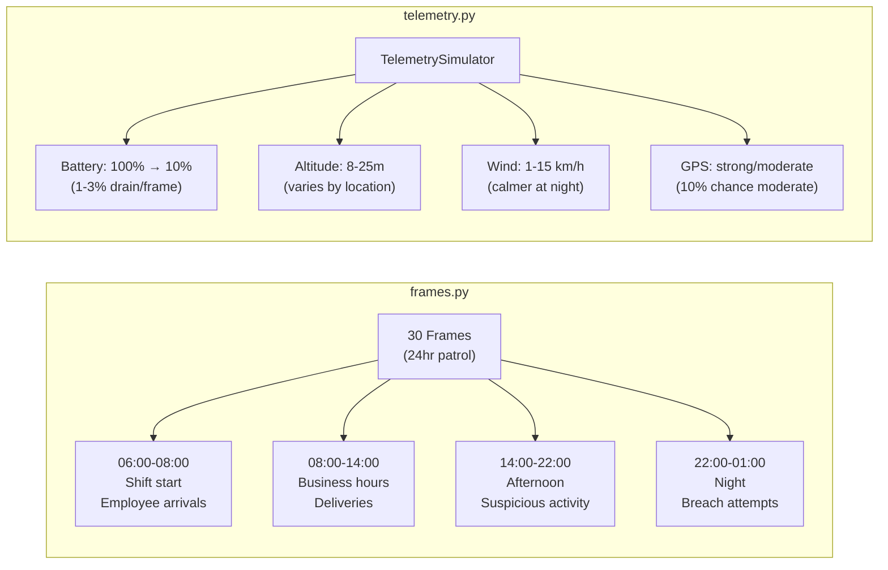
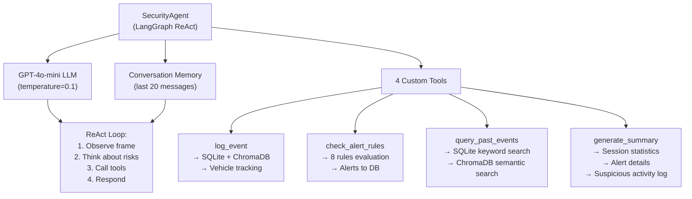
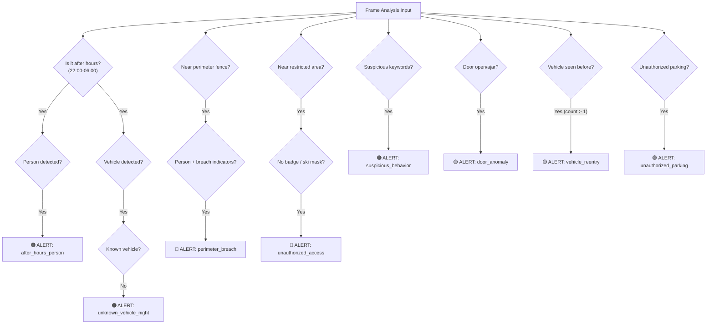
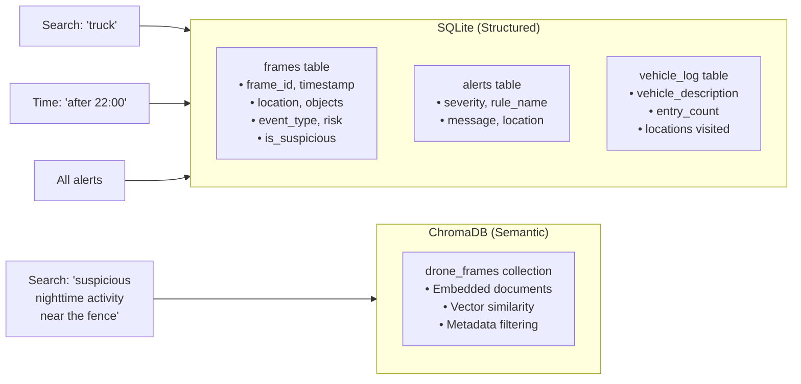

# 🛡️ Drone Security Analyst Agent

An AI-powered autonomous drone surveillance system that monitors industrial properties 24/7, detects security threats in real-time, and generates searchable event history using **LangChain**, **OpenAI GPT-4o-mini**, **Grounding DINO + DeepSORT**, and dual-database indexing (**SQLite + ChromaDB Cloud**).

> **Property:** SecureTech Industrial Complex · **Drone:** DRN-01 · **Mode:** Autonomous Patrol

---

## 📑 Table of Contents

- [Architecture Overview](#-architecture-overview)
- [How It Works — Complete Flow](#-how-it-works--complete-flow)
  - [1. Simulated Patrol Pipeline](#1-simulated-patrol-pipeline-mainpy)
  - [2. Video Upload Analysis Pipeline](#2-video-upload-analysis-pipeline-serverpy)
  - [3. Query & Retrieval Pipeline](#3-query--retrieval-pipeline)
- [Module Breakdown](#-module-breakdown)
- [Alert Rules Engine](#-alert-rules-engine)
- [Agent Tools](#-agent-tools)
- [Dual Database Architecture](#-dual-database-architecture)
- [Web Dashboard (Aegis Drone Command)](#-web-dashboard--aegis-drone-command)
- [API Reference](#-api-reference)
- [Quick Start](#-quick-start)
- [Project Structure](#-project-structure)
- [Design Decisions](#-design-decisions)
- [Testing](#-testing)
- [Future Improvements](#-future-improvements)

---

## 🏗️ Architecture Overview

```
┌─────────────────────────────────────────────────────────────────────┐
│                     AEGIS DRONE COMMAND CENTER                      │
├─────────────────────────────────────────────────────────────────────┤
│                                                                     │
│  ┌──────────────┐   ┌──────────────┐   ┌──────────────────────┐    │
│  │  Simulated   │   │  Real Video  │   │   Telemetry          │    │
│  │  30 Frames   │   │  Upload      │   │   Simulator          │    │
│  │  (24hr cycle)│   │  (MP4/AVI)   │   │   (GPS/Battery/Alt)  │    │
│  └──────┬───────┘   └──────┬───────┘   └──────────┬───────────┘    │
│         │                  │                       │                │
│         │          ┌───────┴────────┐              │                │
│         │          │  Grounding     │              │                │
│         │          │  DINO +        │              │                │
│         │          │  DeepSORT      │              │                │
│         │          └───────┬────────┘              │                │
│         │                  │                       │                │
│         ▼                  ▼                       │                │
│  ┌─────────────────────────────────────┐           │                │
│  │     VLM Analyzer (GPT-4o-mini)      │◄──────────┘                │
│  │  Structured JSON: objects, risk,    │                            │
│  │  event_type, is_suspicious, action  │                            │
│  └──────────────┬──────────────────────┘                            │
│                 │                                                    │
│                 ▼                                                    │
│  ┌─────────────────────────────────────┐                            │
│  │  LangChain ReAct Agent (LangGraph)  │                            │
│  │  ┌─────────┐ ┌──────────┐          │                            │
│  │  │log_event│ │check_    │          │                            │
│  │  │         │ │alert_    │          │                            │
│  │  │         │ │rules     │          │                            │
│  │  └────┬────┘ └────┬─────┘          │                            │
│  │  ┌────┴────┐ ┌────┴─────┐          │                            │
│  │  │query_   │ │generate_ │          │                            │
│  │  │past_    │ │summary   │          │                            │
│  │  │events   │ │          │          │                            │
│  │  └─────────┘ └──────────┘          │                            │
│  └──────────────┬──────────────────────┘                            │
│                 │                                                    │
│        ┌────────┴────────┐                                          │
│        ▼                 ▼                                          │
│  ┌───────────┐    ┌────────────┐    ┌──────────────┐               │
│  │  SQLite   │    │  ChromaDB  │    │ Alert Engine │               │
│  │ Structured│    │  Semantic  │    │  8 Rules     │               │
│  │  Queries  │    │  Vector    │    │  4 Severity  │               │
│  │           │    │  Search    │    │  Levels      │               │
│  └───────────┘    └────────────┘    └──────────────┘               │
│                                                                     │
├─────────────────────────────────────────────────────────────────────┤
│  OUTPUT INTERFACES                                                  │
│  ┌────────────┐  ┌────────────┐  ┌───────────┐  ┌──────────────┐  │
│  │ Web UI     │  │ Streamlit  │  │ Rich CLI  │  │ Query CLI    │  │
│  │ (FastAPI)  │  │ Dashboard  │  │ (main.py) │  │ (query.py)   │  │
│  └────────────┘  └────────────┘  └───────────┘  └──────────────┘  │
└─────────────────────────────────────────────────────────────────────┘
```

---

## 🔄 How It Works — Complete Flow

### 1. Simulated Patrol Pipeline (`main.py`)

This is the core monitoring pipeline that processes 30 pre-defined frames covering a full 24-hour patrol cycle.



**What happens at each step:**

| Step | Component | Input | Output |
|------|-----------|-------|--------|
| 1 | `TelemetrySimulator` | Time + Location | GPS, altitude, battery, wind, status |
| 2 | `vlm_analyzer.analyze_frame()` | Text description + telemetry | Structured JSON (objects, risk, event_type) |
| 3 | `SecurityAgent.process_frame()` | Frame + analysis + telemetry | Agent response, alerts, tool call results |
| 4 | `Rich Console` | All above | Color-coded terminal output |

---

### 2. Video Upload Analysis Pipeline (`server.py`)

When a user uploads a real video through the web dashboard, it goes through a **dual-detection pipeline** combining Grounding DINO (open-vocabulary detection with text prompts) with GPT-4o-mini Vision (contextual understanding).

```mermaid
flowchart TD
    A["📹 User Uploads Video\n(MP4/AVI/MKV)"] --> B["Save to data/ directory"]

    B --> C["Extract Frames\n• Interval: 2 sec (dynamic)\n• Max: 20 frames\n• JPEG quality: 90%\n• Keep raw + base64"]

    C --> D{{"FOR EACH FRAME"}}

    D --> E["🔍 Step 1: Grounding DINO\n(Open-Vocab + DeepSORT)"]
    E --> E1["Detect objects via\ntext prompts — 28+\nsecurity-relevant classes"]
    E1 --> E2["Track objects across frames\nwith persistent IDs"]
    E2 --> E3["Output: objects list +\ndetections with confidence %"]

    D --> F["🧠 Step 2: Vision AI\n(GPT-4o-mini Vision API)"]
    E3 --> F
    F --> F1["Send base64 frame image\nat HIGH detail resolution"]
    F1 --> F2["Enhanced prompt asks for:\n• ALL people (count + clothing)\n• ALL vehicles (type + color)\n• ALL animals + objects\n• Activities + concerns"]
    F2 --> F3["Grounding DINO results sent\nas hints for cross-referencing"]
    F3 --> F4["Output: 4-6 sentence\ndetailed description"]

    F4 --> G["🔬 Step 3: Security Analysis\n(GPT-4o-mini Text API)"]
    G --> G1["Analyze description against\nsecurity rules and context"]
    G1 --> G2["Output: Structured JSON\n(objects, event_type, risk,\nis_suspicious, action)"]

    G2 --> H["🔀 Step 4: Merge Results"]
    E3 --> H
    H --> H1["Combine G-DINO objects\n+ VLM objects\n(deduplicated)"]
    H1 --> H2["Add detection counts\n+ confidence scores"]

    H2 --> I["📡 Stream via SSE\n(Server-Sent Events)"]
    I --> J["Web Dashboard displays:\n• Objects detected\n• G-DINO confidence %\n• Risk assessment\n• Recommended action"]

    J --> K{"More frames?"}
    K -- "Yes" --> D
    K -- "No" --> L["✅ Analysis Complete"]

    style A fill:#ff6d00,color:#000
    style E fill:#00c853,color:#000
    style F fill:#1565c0,color:#fff
    style G fill:#6a1b9a,color:#fff
    style H fill:#ffd600,color:#000
    style L fill:#00c853,color:#000
```



**Why dual detection?**

| Detection Method | Strengths | Weaknesses |
|------------------|-----------|------------|
| **Grounding DINO** | Open-vocabulary (detect anything via text), bounding boxes, confidence scores, zero-shot — no retraining needed | Heavier than YOLO (~2-4s/frame on CPU), requires HuggingFace model download |
| **GPT-4o-mini Vision** | Understands context, describes activities, identifies suspicious behavior | Can miss small objects, no bounding boxes, slower |
| **Combined** | ✅ Best of both — open-vocabulary detection AND contextual understanding | Slightly more API cost |

---

### 3. Query & Retrieval Pipeline

After a monitoring session, all data is queryable through multiple interfaces.



**Query types supported:**

| Query Type | Engine | Example |
|------------|--------|---------|
| Object search | SQLite | `--object "truck"` |
| Time range | SQLite | `--time "after 22:00"` |
| Location | SQLite | `--location "Main Gate"` |
| Suspicious only | SQLite | `--suspicious` |
| Alert log | SQLite | `--alerts` |
| Natural language | ChromaDB | `--search "suspicious nighttime activity"` |
| Session stats | SQLite | `--summary` |

---

## 📦 Module Breakdown

### Simulators (`simulators/`)



### Analysis (`analysis/vlm_analyzer.py`)

The VLM Analyzer sends each frame description to **GPT-4o-mini** with a detailed security analyst system prompt. It returns structured JSON:

```json
{
    "objects": ["Person in dark hoodie", "Backpack"],
    "event_type": "suspicious_activity",
    "risk_level": "high",
    "is_suspicious": true,
    "description": "Unidentified person near perimeter fence taking photos",
    "recommended_action": "Dispatch security"
}
```

If the API fails, a **fallback parser** uses keyword matching to extract basic analysis from the description text.

### Object Detection (`detector.py`)

The `VideoDetector` class uses **Grounding DINO** (via HuggingFace Transformers) with **DeepSORT** tracking:

- **Open-vocabulary detection** — detect any object by text prompt, no fixed class limit
- **28+ security-focused classes** — person, car, truck, weapon, knife, gun, fire, smoke, drone, fence, gate, door, etc.
- **Dynamic prompts** — change what you detect at runtime with `set_prompt()`
- **Persistent tracking IDs** — same object keeps its ID across frames via DeepSORT
- **Color-coded bounding boxes** — orange for people, red for weapons, magenta for drones
- **Confidence threshold** — configurable (default 0.3 for video, 0.4 for live)
- **Zero-shot** — no retraining needed to detect new object types

### Agent (`agent/`)



The agent uses a **ReAct (Reason + Act)** loop — it observes each frame's analysis, reasons about security implications, calls the appropriate tools, and produces an actionable security assessment. It maintains memory of previous frames to detect patterns like:
- **Vehicle re-entry** — same vehicle seen multiple times
- **Loitering** — person in consecutive frames near restricted area  
- **Threat escalation** — person near fence → person climbing fence

---

## 🚨 Alert Rules Engine

The `AlertManager` evaluates **8 configurable rules** against each frame:

| # | Rule | Severity | Trigger Condition |
|---|------|----------|-------------------|
| 1 | `after_hours_person` | 🟠 HIGH | Person detected between 22:00–06:00 |
| 2 | `perimeter_breach` | 🔴 CRITICAL | Person near fence + breach indicators (climb, cut, test) |
| 3 | `unauthorized_access` | 🔴 CRITICAL | No badge/ski mask near server room, warehouse, loading dock |
| 4 | `unknown_vehicle_night` | 🟠 HIGH | Unrecognized vehicle after hours |
| 5 | `vehicle_reentry` | 🟡 MEDIUM | Same vehicle seen >1 time (possible surveillance) |
| 6 | `suspicious_behavior` | 🟠 HIGH | Keywords: loitering, photographing, circling, casing |
| 7 | `door_anomaly` | 🟡 MEDIUM | Door open/ajar outside normal hours |
| 8 | `unauthorized_parking` | 🟢 LOW | Vehicle in unauthorized parking zone |



---

## 🗄️ Dual Database Architecture



| Feature | SQLite | ChromaDB |
|---------|--------|----------|
| **Query Type** | Keyword, time, location, exact match | Natural language, semantic similarity |
| **Speed** | Very fast (indexed SQL) | Fast (vector ANN search) |
| **Use Case** | "Show all trucks" / "Alerts after 10pm" | "Suspicious activity near fence at night" |
| **Storage** | `data/security_events.db` | ChromaDB Cloud (or local `data/chroma_db/` fallback) |

---

## 🖥️ Web Dashboard — Aegis Drone Command

The web dashboard (`server.py` + `static/`) provides a military-industrial command center UI with 5 pages:

| Page | File | Description |
|------|------|-------------|
| **Live Feed** | `index.html` | Real-time simulation with SSE streaming, metrics, frame log |
| **Video Analysis** | `video.html` | Upload video → Grounding DINO + Vision AI detection with operational log |
| **Alerts** | `alerts.html` | Alert dashboard with severity filtering |
| **Query Frames** | `query.html` | Keyword + semantic search with filters |
| **Daily Summary** | `summary.html` | AI-generated security briefing |

---

## 📡 API Reference

| Method | Endpoint | Description |
|--------|----------|-------------|
| `GET` | `/` | Serve main dashboard |
| `GET` | `/health` | Health check (keep-alive endpoint) |
| `GET` | `/api/status` | Current simulation state |
| `GET` | `/api/simulate` | **SSE** — Start patrol simulation, stream results |
| `POST` | `/api/halt` | **Emergency halt** — stop running simulation immediately |
| `POST` | `/api/reset` | Force-reset simulation state |
| `GET` | `/api/alerts?severity=CRITICAL` | Get alerts, optional severity filter |
| `GET` | `/api/frames` | Get all processed frames |
| `GET` | `/api/frames/search?q=truck&risk=HIGH` | Search frames by keyword + risk |
| `GET` | `/api/semantic?q=suspicious+activity` | ChromaDB semantic search |
| `GET` | `/api/summary` | Get current session summary |
| `POST` | `/api/generate_summary` | Generate fresh AI summary |
| `POST` | `/api/analyze_video` | **SSE** — Upload video for dual detection |
| `GET` | `/api/stats` | Database statistics |

---

## 🚀 Quick Start

### Prerequisites

- **Python 3.10+**
- **OpenAI API Key** (for GPT-4o-mini)

### Setup

```bash
# Clone the repository
cd "Drone Scecurity Analyst Agent"

# Create virtual environment
python -m venv venv
venv\Scripts\activate        # Windows
# source venv/bin/activate   # Linux/Mac

# Install dependencies
pip install -r requirements.txt

# Configure API key
copy .env.example .env
# Edit .env and add your OPENAI_API_KEY
```

### Run Options

```bash
# Option 1: Web Dashboard (recommended)
python server.py
# Open http://localhost:8000

# Option 2: CLI Monitoring Pipeline
python main.py

# Option 3: Streamlit Dashboard
streamlit run app.py

# Option 4: Query past events
python query.py --object "truck"
python query.py --search "suspicious nighttime activity"
python query.py --alerts
python query.py --summary
```

---

## 📁 Project Structure

```
Drone Security Analyst Agent/
│
├── server.py                  # FastAPI backend + REST API + SSE endpoints
├── app.py                     # Streamlit dashboard (alternative UI)
├── main.py                    # CLI monitoring pipeline
├── query.py                   # CLI query interface (7 query types)
├── config.py                  # Central config (API keys, paths, constants)
├── detector.py                # Grounding DINO + DeepSORT video object detector
├── requirements.txt           # Python dependencies
├── .env                       # API keys (gitignored)
│
├── simulators/
│   ├── frames.py              # 30 simulated drone frames (24hr cycle)
│   └── telemetry.py           # GPS, altitude, battery, wind simulation
│
├── analysis/
│   └── vlm_analyzer.py        # GPT-4o-mini frame analysis → structured JSON
│
├── agent/
│   ├── security_agent.py      # LangGraph ReAct agent with memory
│   ├── tools.py               # 4 custom LangChain tools
│   └── prompts.py             # System prompts for agent behavior
│
├── indexing/
│   ├── sqlite_store.py        # SQLite structured storage (3 tables)
│   └── chroma_store.py        # ChromaDB semantic vector search
│
├── alerts/
│   └── rules_engine.py        # 8 configurable alert rules
│
├── static/
│   ├── index.html             # Live Feed page
│   ├── video.html             # Video Analysis page
│   ├── alerts.html            # Alert Dashboard page
│   ├── query.html             # Query Frames page
│   ├── summary.html           # Daily Summary page
│   └── shell.js               # Shared navigation + sidebar shell
│
├── tests/
│   ├── test_telemetry.py      # Telemetry simulator tests
│   ├── test_alerts.py         # Alert rules engine tests (10 tests)
│   ├── test_indexing.py       # SQLite + ChromaDB tests
│   └── test_agent.py          # Agent tool integration tests
│
├── docs/
│   ├── architecture.md        # Architecture document
│   └── feature_spec.md        # Feature specification
│
└── data/                      # Generated at runtime
    ├── security_events.db     # SQLite database
    └── chroma_db/             # ChromaDB vector store
```

---

## 🔧 Design Decisions

| Decision | Choice | Rationale |
|----------|--------|-----------|
| LLM Backend | GPT-4o-mini | Fast inference, vision capability, good JSON output, cost-effective |
| Agent Framework | LangGraph ReAct | Industry standard, tool-calling, memory management, reasoning loop |
| Object Detection | Grounding DINO + DeepSORT | Open-vocabulary zero-shot detection, text-prompted, persistent tracking IDs |
| Structured DB | SQLite | Zero-config, built into Python, fast keyword/time queries |
| Vector DB | ChromaDB Cloud | Managed cloud storage with local fallback, built-in embeddings |
| Dual Detection | Grounding DINO + Vision API | Open-vocabulary bounding boxes + contextual scene understanding |
| Web Framework | FastAPI + SSE | Async, real-time streaming, auto-generated API docs |
| Console UX | Rich library | Professional colored output, tables, progress bars |
| Memory | Last 20 messages | Cross-frame context for pattern recognition without token overflow |
| Emergency Control | /api/halt + SSE events | Real-time simulation halt with proper UI state cleanup |

---

## 🧪 Testing

```bash
# Run all tests
pytest tests/ -v

# Run specific test file
pytest tests/test_alerts.py -v
pytest tests/test_indexing.py -v
```

**Test coverage:**
- `test_telemetry.py` — Battery drain, altitude ranges, wind simulation
- `test_alerts.py` — All 8 alert rules with positive/negative cases (10 tests)
- `test_indexing.py` — SQLite CRUD, ChromaDB semantic search, vehicle tracking
- `test_agent.py` — Agent tool calling, LangGraph integration

---

## 🤖 AI Tools Used

- **OpenAI GPT-4o-mini** — Frame analysis (VLM) and agent reasoning
- **LangChain + LangGraph** — Agent orchestration, tool management, ReAct loop
- **Grounding DINO** (HuggingFace Transformers) — Open-vocabulary zero-shot object detection via text prompts
- **DeepSORT** — Multi-object tracking with persistent IDs
- **ChromaDB Cloud** — Managed semantic vector embeddings with local fallback

---

## 🔮 Future Improvements

- Real video input with OpenCV and actual camera feeds
- Multi-drone support with coordinated patrol routes
- SAM 2 segmentation for pixel-level object masking
- VideoMAE for action understanding and behavior analysis
- Integration with real alert systems (SMS, email, Slack)
- Geofencing with GPS-based zone definitions
- Historical pattern analysis with time-series ML models
- WebSocket-based real-time drone telemetry streaming

---

## 📝 License

MIT License
